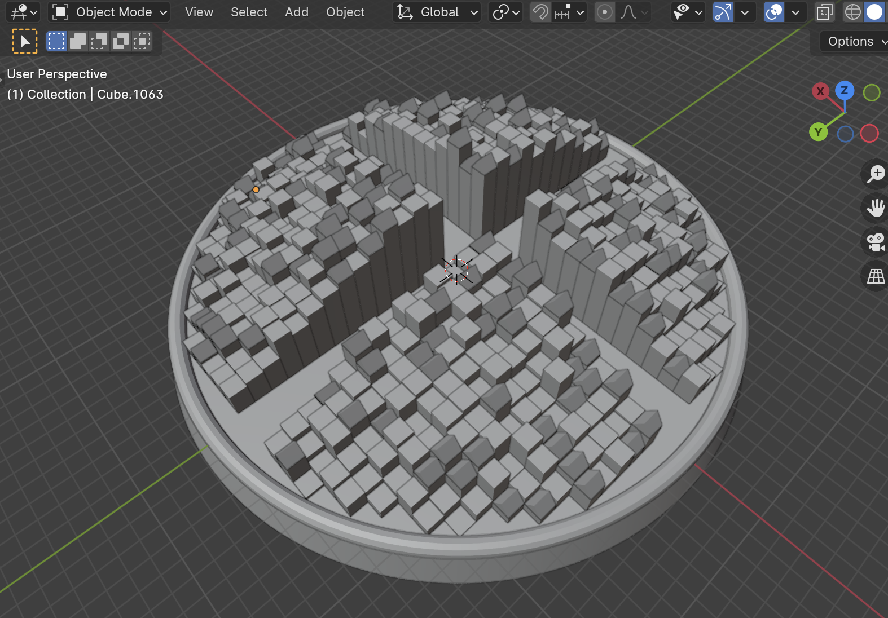

# 🏙️ Blender City Generation with Genetic Algorithm
---
<table>
  <tr>
    <td width="60%">
      <p align="center">
        
      </p>
    </td>
    <td width="40%">
      This Blender project uses Python scripting to generate a city layout and buildings using a genetic algorithm approach. The goal is to evolve city layouts based on specified parameters and evaluate them for their fitness (in this case, the total height of buildings).
    </td>
  </tr>
</table>

## Getting Started

To use this script, you'll need Blender installed on your system. Blender is a free and open-source 3D creation suite. You can download it from [blender.org](https://www.blender.org/download/).

### Installation

1. **Download Blender:** Visit [blender.org](https://www.blender.org/download/) and download Blender for your operating system.
2. **Open Blender:** Launch Blender and open the Python script provided (`city_generation.py`) in the Scripting workspace.

### Prerequisites

- **Blender Version:** This script has been tested with Blender version 4.0.
- **Python Version:** Blender's embedded Python interpreter is used. No external Python installation is required.

## Script Overview

The Python script (`city_generation.py`) uses a genetic algorithm to evolve city layouts based on the following parameters:

- `roadwidth1`: Width of roads in the city.
- `MINheight`, `MAXheight`: Minimum and maximum height of buildings.
- `MINvert`, `MAXvert`: Minimum and maximum number of vertices per building.
- `amount`: Number of buildings in the city.

### Functionalities

1. **`generate_random_individual()`**
   - Generates a random set of parameters for the city layout.

2. **`crossover(parent1, parent2)`**
   - Performs crossover between two individuals to create offspring.

3. **`mutate(individual)`**
   - Introduces random mutations in an individual to explore new solutions.

4. **`evaluate_fitness(individual)`**
   - Evaluates the fitness of an individual based on the total height of buildings generated.

5. **`generate_city_with_shape_grammar(individual)`**
   - Generates the city layout and buildings based on the parameters of the individual using shape grammar.

6. **`render_scene()`**
   - Prints the fitness value (total height of buildings) of the current city layout.

### Usage

1. **Open Blender:**
   - Open Blender and switch to the Scripting workspace.
   
2. **Load Script:**
   - Load the provided script (`city_generation.py`) into the text editor.
   
3. **Run Script:**
   - Run the script to start generating city layouts based on the genetic algorithm.

### Example Usage

```python
# Example usage within Blender Scripting workspace
import bpy

# Load the script
bpy.ops.text.open(filepath="/path/to/city_generation.py")

# Run the script
bpy.ops.text.run_script()
```

### Parameters Adjustment

You can adjust the parameters (`roadwidth1`, `MINheight`, `MAXheight`, `MINvert`, `MAXvert`, `amount`) in the script to explore different city layouts and building configurations.
